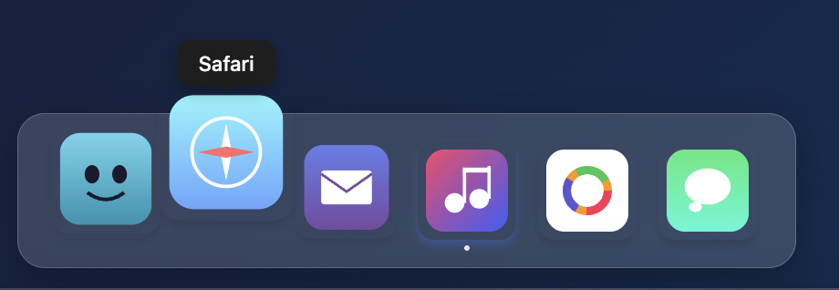

# @security-scan-console/dock-nav

A macOS-style dock navigation component for React with smooth magnification effects.



## Installation

```bash
npm install @security-scan-console/dock-nav
```

## Usage

```tsx
import { DockNav, DockNavItem } from "@security-scan-console/dock-nav";

const HomeIcon = (props) => (
  <svg {...props} viewBox="0 0 24 24" fill="currentColor">
    <path d="M10 20v-6h4v6h5v-8h3L12 3 2 12h3v8z" />
  </svg>
);

const items: DockNavItem[] = [
  { id: "home", label: "Home", icon: HomeIcon },
  { id: "settings", label: "Settings", icon: SettingsIcon },
];

function App() {
  return (
    <DockNav
      items={items}
      position="top"
      onNavigate={(id) => console.log("Navigated to:", id)}
    />
  );
}
```

## Props

| Prop            | Type                   | Default  | Description                                         |
| --------------- | ---------------------- | -------- | --------------------------------------------------- |
| `items`         | `DockNavItem[]`        | required | Navigation items                                    |
| `position`      | `"top" \| "bottom"`    | `"top"`  | Dock position                                       |
| `style`         | `CSSProperties`        | -        | Custom styles                                       |
| `onNavigate`    | `(id: string) => void` | -        | Navigation callback                                 |
| `activeId`      | `string`               | -        | Controlled active item                              |
| `observeScroll` | `boolean`              | `false`  | Auto-detect active section via IntersectionObserver |
| `baseSize`      | `number`               | `48`     | Base icon size in pixels                            |
| `maxScale`      | `number`               | `1.4`    | Max magnification multiplier                        |

## Features

- Smooth magnification effect on hover (like macOS dock)
- Keyboard navigation support
- Respects `prefers-reduced-motion`
- Optional scroll-based active detection
- Zero external CSS dependencies
